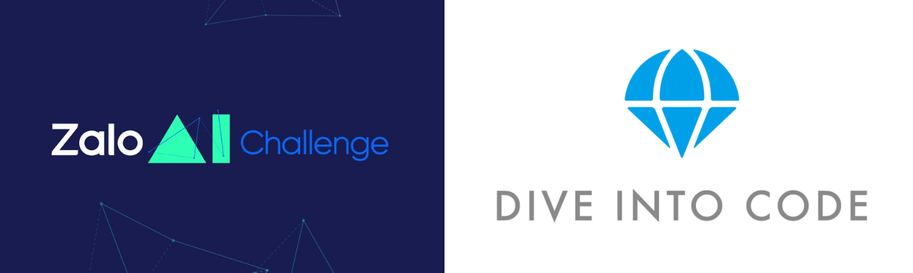

<div id="top"></div>
<!--
*** Thanks for checking out the Best-README-Template. If you have a suggestion
*** that would make this better, please fork the repo and create a pull request
*** or simply open an issue with the tag "enhancement".
*** Don't forget to give the project a star!
*** Thanks again! Now go create something AMAZING! :D
-->


<!-- PROJECT SHIELDS -->
<!--
*** I'm using markdown "reference style" links for readability.
*** Reference links are enclosed in brackets [ ] instead of parentheses ( ).
*** See the bottom of this document for the declaration of the reference variables
*** for contributors-url, forks-url, etc. This is an optional, concise syntax you may use.
*** https://www.markdownguide.org/basic-syntax/#reference-style-links
-->
[![Contributors][contributors-shield]][contributors-url]
[![Forks][forks-shield]][forks-url]
[![Stargazers][stars-shield]][stars-url]
[![Issues][issues-shield]][issues-url]
[![MIT License][license-shield]][license-url]
[![LinkedIn][linkedin-shield]][linkedin-url]


<!-- PROJECT LOGO -->
<br />
<div align="center">
  <a href="https://github.com/anhtien228/diveintocode-ml-graduation">
    
  </a>

  <h3 align="center">DIVE INTO CODE Graduation Assignment</h3>

  <p align="center">
    A repository for the graduation assignment from the Machine Learning Engineer course, which is a costless offer from the DIVE INTO CODE company to the students of Ho Chi Minh City University of Technology. The academic year took place from 2021 to 2022.
    <br />
    <a href="https://github.com/anhtien228/diveintocode-ml-graduation"><strong>Explore the docs »</strong></a>
    <br />
    <br />
    <a href="https://github.com/anhtien228/diveintocode-ml-graduation">View Demo</a>
    ·
    <a href="https://github.com/anhtien228/diveintocode-ml-graduation/issues">Report Bug</a>
    ·
    <a href="https://github.com/anhtien228/diveintocode-ml-graduation/issues">Request Feature</a>
  </p>
</div>


<!-- TABLE OF CONTENTS -->
<details>
  <summary>Table of Contents</summary>
  <ol>
    <li>
      <a href="#about-the-project">About The Project</a>
      <ul>
        <li><a href="#built-with">Built With</a></li>
      </ul>
    </li>
    <li>
      <a href="#getting-started">Getting Started</a>
      <ul>
        <li><a href="#prerequisites">Prerequisites</a></li>
        <li><a href="#installation">Installation</a></li>
      </ul>
    </li>
    <li><a href="#usage">Usage</a></li>
    <li><a href="#roadmap">Roadmap</a></li>
    <li><a href="#contributing">Contributing</a></li>
    <li><a href="#license">License</a></li>
    <li><a href="#contact">Contact</a></li>
    <li><a href="#acknowledgments">Acknowledgments</a></li>
  </ol>
</details>


<!-- ABOUT THE PROJECT -->
## About The Project

The concept and objective of this project is based on one of the challenges of Zalo AI Challenge 2021, the 5k Compliance. During the Covid-19 outbreak, the Vietnamese government pushed the "5K" public health safety message. In the message, masking and keeping a safe distance are two key rules that have been shown to be extremely successful in preventing people from contracting or spreading the virus. Enforcing these principles on a large scale is where technology may help. In this challenge, we will create algorithm to detect whether or not a person or group of individuals in a picture adhere to the "mask" and "distance" standards.

<p align="right">(<a href="#top">back to top</a>)</p>


### Built With

The notebook were used along with many IDE due to the inconsistent performance of GPU resources. I also include the frameworks that are the cores of my implementation.

* [Google Colaboratory](https://colab.research.google.com/?utm_source=scs-index)
* [Kaggle Notebook](https://www.kaggle.com)
* [Tensorflow](https://www.tensorflow.org)
* [Keras](https://keras.io)
* [WandB](https://wandb.ai)

<p align="right">(<a href="#top">back to top</a>)</p>


<!-- GETTING STARTED -->
## Getting Started

Since all implementation are built in the notebooks, you just need to open and run it.

### Prerequisites

The only file that maybe run first is the requirement.txt as you may have not installed many required packages or you use the based python environment without any libraries
* requirement.txt
  ```sh
  pip install -r requirements.txt
  ```

About WandB, you will need to create an account and get the API key for further usages.

_For more examples, please refer to the [WandB Documentation](https://docs.wandb.ai)_


<!-- USAGE EXAMPLES -->
## Usage

Open the notebooks on Google Colaborary or Visual Studio Code is more appropriate as Kaggle (where it ran) will erase all available outputs in the notebooks.

The report for detailed explanation and discussion conducted by me can be found at the repositry, named [MEF2103_AnhTien_Doan_Graduation.pdf](MEF2103_AnhTien_Doan_Graduation.pdf)

The report for experimental data and metrics analyzing can be found at this link: [Comparision of different metrics](https://wandb.ai/atien228/diveintocode-grad-results-graph/reports/Comparison-of-different-metrics--VmlldzoxNjE2NjEx). Written on WandB


<p align="right">(<a href="#top">back to top</a>)</p>


<!-- LICENSE -->
## License

Distributed under the MIT License. See `LICENSE.txt` for more information.

<p align="right">(<a href="#top">back to top</a>)</p>


<!-- CONTACT -->
## Contact

Doan Anh Tien - Linkedin: [atien228](https://www.linkedin.com/in/atien228/) - d.atien228@gmail.com

Project Link: [diveintocode-ml-graduation](https://github.com/anhtien228/diveintocode-ml-graduation)

<p align="right">(<a href="#top">back to top</a>)</p>


<!-- ACKNOWLEDGMENTS -->
## Acknowledgments

Here is the list of resources that I have found during the research and I believe it would be useful for you too.

* [EfficientNet](https://arxiv.org/abs/1905.11946)
* [EfficientNetV2](https://arxiv.org/abs/2104.00298)
* [MobileNetV2: Inverted Residuals and Linear Bottlenecks](https://towardsdatascience.com/mobilenetv2-inverted-residuals-and-linear-bottlenecks-8a4362f4ffd5)
* [L1 and L2 Regularization](https://towardsdatascience.com/l1-and-l2-regularization-methods-ce25e7fc831c)
* [The Vanishing Gradient Problem](https://towardsdatascience.com/the-vanishing-gradient-problem-69bf08b15484)


<p align="right">(<a href="#top">back to top</a>)</p>


<!-- MARKDOWN LINKS & IMAGES -->
<!-- https://www.markdownguide.org/basic-syntax/#reference-style-links -->
[contributors-shield]: https://img.shields.io/github/contributors/anhtien228/diveintocode-ml-graduation.svg?style=for-the-badge
[contributors-url]: https://github.com/anhtien228/diveintocode-ml-graduation/graphs/contributors
[forks-shield]: https://img.shields.io/github/forks/anhtien228/diveintocode-ml-graduation.svg?style=for-the-badge
[forks-url]: https://github.com/anhtien228/diveintocode-ml-graduation/network/members
[stars-shield]: https://img.shields.io/github/stars/anhtien228/diveintocode-ml-graduation.svg?style=for-the-badge
[stars-url]: https://github.com/anhtien228/diveintocode-ml-graduation/stargazers
[issues-shield]: https://img.shields.io/github/issues/anhtien228/diveintocode-ml-graduation.svg?style=for-the-badge
[issues-url]: https://github.com/anhtien228/diveintocode-ml-graduation/issues
[license-shield]: https://img.shields.io/github/license/anhtien228/diveintocode-ml-graduation.svg?style=for-the-badge
[license-url]: https://github.com/anhtien228/diveintocode-ml-graduation/master/LICENSE.txt
[linkedin-shield]: https://img.shields.io/badge/-LinkedIn-black.svg?style=for-the-badge&logo=linkedin&colorB=555
[linkedin-url]: https://www.linkedin.com/in/atien228/
[product-screenshot]: images/screenshot.png
